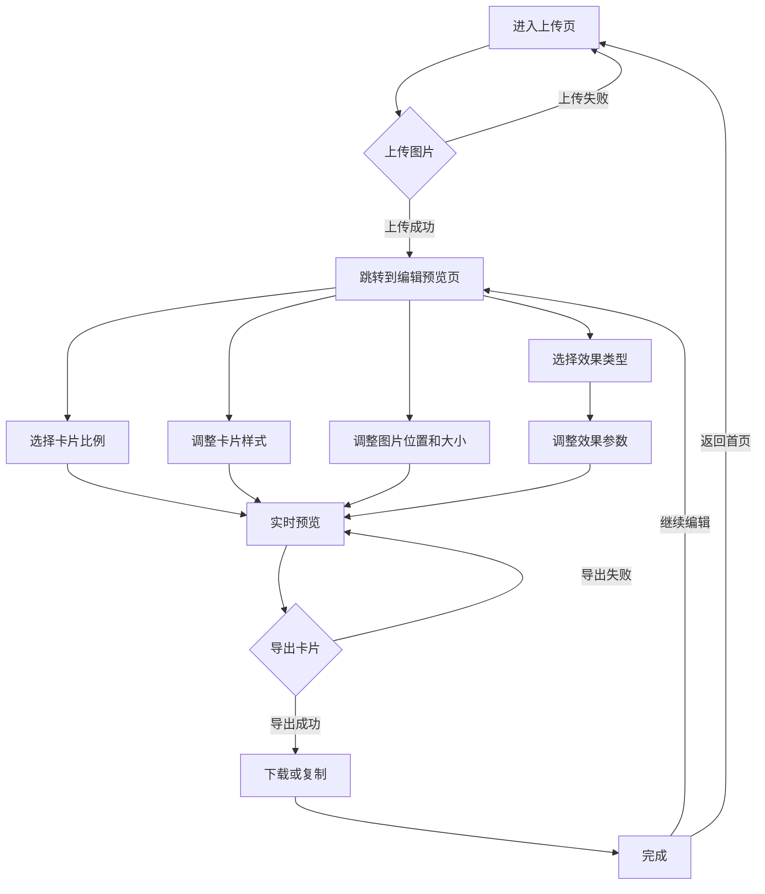
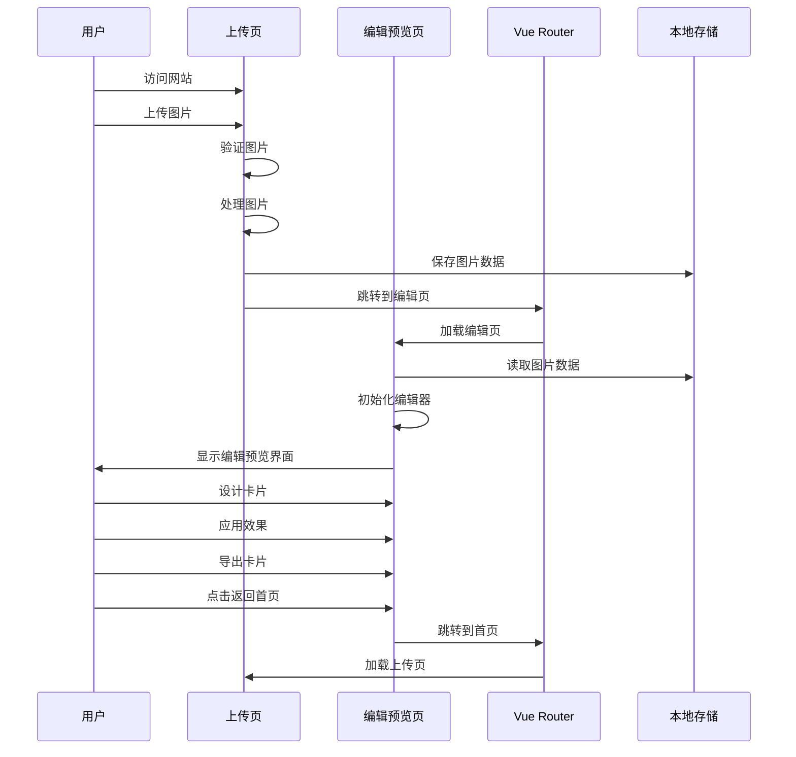

# 双页面多效果图片展示卡片生成工具设计文档

## 1. 项目概述

### 1.1 项目背景
结合两个设计文档的核心功能，开发一个双页面的多效果图片展示卡片生成工具。用户可以在上传页上传图片，然后在编辑预览页调整图片位置、大小和样式，应用多种预设效果，最终导出完整的展示卡片。

### 1.2 核心功能
- 双页面结构：上传页（首页）+ 编辑预览页
- 支持多种图片格式上传（JPG、PNG、WebP）
- 图片在卡片上的缩放、定位、旋转和翻转
- 多种预设效果（毛玻璃、复古、赛博朋克等）
- 实时预览和参数调整
- 多种格式导出（PNG、JPG、WebP）

### 1.3 技术栈
- **前端框架**：Vue 3 + TypeScript
- **构建工具**：Vite
- **图片处理**：Canvas API
- **样式方案**：CSS3 + CSS Variables
- **动画效果**：CSS Animations + Web Animations API

## 2. 系统架构

### 2.1 双页面架构设计

| 页面名称 | 主要功能 | 路由路径 |
|---------|---------|---------|
| 上传页 | 图片上传、格式验证、大小限制 | / |
| 编辑预览页 | 卡片设计、效果应用、实时预览、导出 | /editor |

### 2.2 核心模块

| 模块名称 | 主要功能 | 文件位置 |
|---------|---------|---------|
| 图片上传 | 处理图片上传、拖放功能 | src/components/ImageUploader.vue |
| 卡片设计 | 调整图片位置、大小和样式 | src/components/CardDesigner.vue |
| 效果选择 | 提供多种效果类型供用户选择 | src/components/EffectSelector.vue |
| 参数调整 | 提供效果参数调整界面 | src/components/ParamsPanel.vue |
| 效果预览 | 实时渲染和预览效果 | src/components/EffectPreview.vue |
| 卡片导出 | 导出最终的展示卡片 | src/components/CardExporter.vue |
| 渲染引擎 | 负责卡片的渲染和预览 | src/engines/rendering/ |
| 图片处理引擎 | 负责图片的加载、解析和处理 | src/engines/image-processing/ |
| 效果计算引擎 | 负责效果参数的计算和处理 | src/engines/effect-calculation/ |

### 2.3 架构流程

```
上传页 → 图片上传 → 验证图片 → 跳转到编辑预览页 → 卡片设计 → 效果应用 → 实时预览 → 卡片导出
```

## 3. 页面设计

### 3.1 上传页（首页）设计

#### 3.1.1 页面布局
- 居中布局，简洁现代的设计风格
- 顶部：网站Logo和标题
- 中央：图片上传区域（支持拖放和文件选择）
- 底部：功能说明和支持的格式信息

#### 3.1.2 核心功能
- **拖放上传**：支持将图片拖放到上传区域
- **文件选择**：点击按钮选择本地图片
- **格式验证**：验证上传图片的格式（JPG、PNG、WebP）
- **大小限制**：单张图片最大10MB
- **即时反馈**：上传成功后立即跳转到编辑预览页

#### 3.1.3 设计示意图

```
┌─────────────────────────────────────────────────────────────┐
│                         顶部区域                             │
│  ┌───────────┐                                             │
│  │   Logo    │  图片展示卡片生成工具                          │
│  └───────────┘                                             │
├─────────────────────────────────────────────────────────────┤
│                         上传区域                             │
│  ┌─────────────────────────────────────────────────────┐     │
│  │                                                     │     │
│  │                     拖放区域                         │     │
│  │                或点击选择图片                         │     │
│  │                                                     │     │
│  │  支持 JPG、PNG、WebP 格式，单张不超过 10MB            │     │
│  │                                                     │     │
│  └─────────────────────────────────────────────────────┘     │
├─────────────────────────────────────────────────────────────┤
│                         底部区域                             │
│  功能说明和支持信息                                           │
└─────────────────────────────────────────────────────────────┘
```

### 3.2 编辑预览页设计

#### 3.2.1 页面布局
- **左侧**：控制面板（效果选择、参数调整）
- **中央**：实时预览区域（卡片展示、图片操作）
- **右侧**：导出面板（导出设置、导出按钮）

#### 3.2.2 核心功能
- **效果选择**：以卡片形式展示多种预设效果
- **参数调整**：根据选择的效果动态生成参数调整控件
- **图片操作**：支持缩放、拖拽、旋转、翻转
- **实时预览**：参数调整后立即更新预览效果
- **卡片导出**：支持多种格式和质量选项

#### 3.2.3 设计示意图

```
┌─────────────────────────────────────────────────────────────┐
│                         顶部导航                             │
│  ┌───────────┐  编辑预览  ┌───────────────────────────────┐   │
│  │   Logo    │            │  返回首页  │  重置  │  导出   │   │
│  └───────────┘            └───────────────────────────────┘   │
├─────────┬─────────────────────────────┬───────────────────────┤
│         │                             │                       │
│         │                             │                       │
│         │                             │                       │
│         │                             │                       │
│  左侧   │         中央预览区域         │         右侧          │
│  控制面板│                             │         导出面板      │
│         │                             │                       │
│         │                             │                       │
│         │                             │                       │
│         │                             │                       │
└─────────┴─────────────────────────────┴───────────────────────┘
```

## 4. 核心功能设计

### 4.1 图片上传功能

#### 4.1.1 实现设计
- **拖放功能**：使用HTML5 Drag & Drop API实现
- **文件选择**：使用`<input type="file">`元素
- **格式支持**：限制为JPG、PNG、WebP等主流格式
- **大小限制**：单张图片不超过10MB
- **预览处理**：上传后立即生成缩略图并显示
- **路由跳转**：上传成功后通过Vue Router跳转到编辑预览页

#### 4.1.2 关键代码设计
```typescript
// 图片上传成功后的处理
const handleUploadSuccess = (imageData: ImageData) => {
  // 保存图片数据到全局状态或本地存储
  localStorage.setItem('currentImage', JSON.stringify(imageData));
  // 跳转到编辑预览页
  router.push('/editor');
};
```

### 4.2 卡片设计功能

#### 4.2.1 卡片基础设置
- **卡片比例**：支持1:1、4:3、16:9三种固定比例
- **尺寸调整**：可自定义卡片尺寸（宽度和高度），或选择预设比例
- **背景设置**：支持自定义卡片背景色、渐变或背景图
- **样式设置**：
  - 圆角效果：默认卡片圆角，可调整圆角半径
  - 悬浮阴影：默认卡片悬浮阴影效果，可调整阴影深度和模糊度
- **图片定位**：默认图片居中显示，支持拖拽调整位置

#### 4.2.2 图片操作
- **缩放**：通过滑块或手势调整图片大小（0.1-5.0倍）
- **定位**：拖拽图片调整在卡片上的位置
- **旋转**：支持0-360度旋转
- **翻转**：支持水平和垂直翻转
- **样式**：可调整图片圆角、阴影和透明度

#### 4.2.3 关键数据模型
```typescript
// 卡片比例类型
type CardRatio = '1:1' | '4:3' | '16:9';

// 卡片数据模型
interface CardData {
  id: string;           // 卡片唯一标识
  width: number;        // 卡片宽度
  height: number;       // 卡片高度
  ratio: CardRatio;     // 卡片比例
  background: string;   // 卡片背景（颜色或渐变）
  border: string;       // 边框样式
  borderRadius: number; // 边框圆角（默认12px）
  boxShadow: string;    // 卡片悬浮阴影（默认悬浮效果）
  imagePosition: {
    x: number;          // 图片X轴偏移（默认居中）
    y: number;          // 图片Y轴偏移（默认居中）
  };
}

// 图片变换模型
interface ImageTransform {
  scale: number;        // 缩放比例（默认1.0）
  x: number;           // X轴偏移（默认0）
  y: number;           // Y轴偏移（默认0）
  rotation: number;    // 旋转角度（默认0度）
  flipX: boolean;      // 水平翻转（默认false）
  flipY: boolean;      // 垂直翻转（默认false）
}

// 图片样式模型
interface ImageStyle {
  borderRadius: number; // 图片圆角
  boxShadow: string;    // 图片阴影
  opacity: number;      // 透明度（0-1）
}
```

### 4.3 效果应用功能

#### 4.3.1 效果类型

| 效果名称 | 实现方式 | 参数调整项 |
|---------|---------|-----------|
| 毛玻璃悬浮立体 | CSS滤镜 + 阴影 + 3D变换 | 模糊程度、透明度、高光强度、阴影深度 |
| 拟态玻璃效果 | CSS box-shadow + backdrop-filter | 阴影深度、模糊程度、透明度、高光强度 |
| 复古胶片 | Canvas图像处理 + 纹理叠加 | 颗粒强度、暗角强度、色彩饱和度、漏光效果 |
| 赛博朋克 | Canvas颜色调整 + 故障效果 | 霓虹色彩强度、故障效果强度、扫描线密度 |
| 水彩画 | Canvas模糊 + 色彩扩散算法 | 笔触大小、色彩扩散程度、纸张纹理强度 |
| 油画 | Canvas笔触模拟 + 色彩混合 | 笔触大小、色彩混合强度、厚重感强度 |
| 素描 | Canvas灰度转换 + 边缘检测 | 线条粗细、对比度、铅笔质感强度 |

#### 4.3.2 效果选择设计
- 以卡片形式展示所有可用效果
- 每个效果卡片显示示例图片
- 支持按效果名称搜索
- 支持效果分类浏览

#### 4.3.3 参数调整设计
- **动态参数面板**：根据选择的效果类型动态生成参数调整控件
- **滑块控件**：使用自定义滑块控件进行参数调整
- **实时预览**：参数调整后立即更新预览效果
- **预设模板**：为每种效果提供多种预设模板

### 4.4 实时预览功能

#### 4.4.1 实现设计
- **Canvas渲染**：使用单个Canvas进行最终效果渲染
- **分层设计**：将背景、图片主体、光影效果分层渲染
- **性能优化**：使用requestAnimationFrame进行高效渲染
- **缩放适配**：根据预览区域大小自适应缩放图片

### 4.5 卡片导出功能

#### 4.5.1 导出格式
- **PNG**：无损格式，适合需要高质量的场景
- **JPG**：有损压缩，适合减小文件大小
- **WebP**：现代格式，平衡质量和大小

#### 4.5.2 导出选项
- 自定义文件名
- 调整导出质量（0-100%）
- 选择导出尺寸（原始尺寸或自定义尺寸）
- 一键复制到剪贴板

## 5. 样式设计

### 5.1 预设卡片比例

| 比例 | 示例尺寸 | 适用场景 |
|-----|---------|---------|
| 1:1 | 600x600px | 社交媒体头像、产品展示 |
| 4:3 | 800x600px | 博客配图、文档插图 |
| 16:9 | 1200x675px | 横幅广告、视频缩略图 |

### 5.2 样式分类设计

#### 5.2.1 卡片样式（容器样式）

卡片样式定义了整个展示容器的外观，包括尺寸、背景、边框、圆角和阴影等。

| 样式属性 | 默认值 | 可调整范围 | 说明 |
|---------|-------|-----------|------|
| width | 800px | 200-2000px | 卡片宽度 |
| height | 600px | 200-2000px | 卡片高度 |
| background | #ffffff | 颜色选择器 | 卡片背景色 |
| border | 0 | 0-20px | 边框样式 |
| borderRadius | 12px | 0-100px | 卡片圆角（默认圆角悬浮效果） |
| boxShadow | 0 8px 32px rgba(0, 0, 0, 0.1) | 阴影编辑器 | 悬浮阴影效果 |

#### 5.2.2 图片外样式（图片在卡片上的显示样式）

图片外样式定义了图片在卡片内部的显示效果，包括位置、大小、透明度、圆角和阴影等。

| 样式属性 | 默认值 | 可调整范围 | 说明 |
|---------|-------|-----------|------|
| position | 居中 | 拖拽调整 | 默认居中显示（垂直水平居中） |
| scale | 1.0 | 0.1-5.0 | 图片缩放比例 |
| opacity | 1.0 | 0.1-1.0 | 图片透明度 |
| borderRadius | 0 | 0-50% | 图片圆角 |
| boxShadow | 无 | 阴影编辑器 | 图片阴影 |
| margin | 0 | 0-100px | 图片与卡片边缘的间距 |

## 6. 核心流程设计

### 6.1 整体流程



### 5.2 页面跳转流程



## 6. 组件设计

### 6.1 上传页组件

#### 6.1.1 ImageUploader 组件
```vue
<template>
  <div 
    class="image-uploader" 
    @dragover="handleDragOver" 
    @dragleave="handleDragLeave" 
    @drop="handleDrop"
  >
    <div v-if="!isDragging" class="upload-content">
      <div class="upload-icon">
        <svg width="64" height="64" viewBox="0 0 24 24" fill="none" stroke="currentColor" stroke-width="2" stroke-linecap="round" stroke-linejoin="round">
          <path d="M21 15v4a2 2 0 0 1-2 2H5a2 2 0 0 1-2-2v-4"></path>
          <polyline points="7 10 12 15 17 10"></polyline>
          <line x1="12" y1="15" x2="12" y2="3"></line>
        </svg>
      </div>
      <h3 class="upload-title">上传图片</h3>
      <p class="upload-subtitle">支持 JPG、PNG、WebP 格式，单张不超过 10MB</p>
      <label class="upload-btn">
        选择文件
        <input 
          type="file" 
          accept="image/jpeg,image/png,image/webp" 
          @change="handleFileSelect"
          ref="fileInput"
        >
      </label>
      <p class="upload-hint">或拖放图片到此处</p>
    </div>
    <div v-else class="upload-dragover">
      <div class="upload-icon">
        <svg width="64" height="64" viewBox="0 0 24 24" fill="none" stroke="currentColor" stroke-width="2" stroke-linecap="round" stroke-linejoin="round">
          <path d="M21 15v4a2 2 0 0 1-2 2H5a2 2 0 0 1-2-2v-4"></path>
          <polyline points="7 10 12 15 17 10"></polyline>
          <line x1="12" y1="15" x2="12" y2="3"></line>
        </svg>
      </div>
      <h3 class="upload-title">释放图片</h3>
      <p class="upload-subtitle">支持 JPG、PNG、WebP 格式，单张不超过 10MB</p>
    </div>
    
    <!-- 加载状态 -->
    <div v-if="isLoading" class="loading-overlay">
      <div class="loading-spinner"></div>
      <p class="loading-text">处理中...</p>
    </div>
    
    <!-- 错误提示 -->
    <div v-if="error" class="error-message">
      <svg width="24" height="24" viewBox="0 0 24 24" fill="none" stroke="currentColor" stroke-width="2" stroke-linecap="round" stroke-linejoin="round">
        <circle cx="12" cy="12" r="10"></circle>
        <line x1="12" y1="8" x2="12" y2="12"></line>
        <line x1="12" y1="16" x2="12.01" y2="16"></line>
      </svg>
      <span>{{ error }}</span>
    </div>
  </div>
</template>
```

### 6.2 编辑预览页组件

#### 6.2.1 CardDesigner 组件
```vue
<template>
  <div class="card-designer">
    <!-- 左侧控制面板 -->
    <aside class="control-panel">
      <!-- 卡片比例选择 -->
      <div class="panel-section">
        <h3 class="panel-title">卡片比例</h3>
        <div class="ratio-buttons">
          <button 
            v-for="ratio in ['1:1', '4:3', '16:9']" 
            :key="ratio"
            :class="{ active: cardData.ratio === ratio }"
            @click="setCardRatio(ratio)"
          >
            {{ ratio }}
          </button>
        </div>
      </div>
      
      <!-- 卡片样式（容器样式） -->
      <div class="panel-section">
        <h3 class="panel-title">卡片样式</h3>
        <div class="control-group">
          <label>宽度</label>
          <input type="range" v-model="cardData.width" min="200" max="2000">
          <span>{{ cardData.width }}px</span>
        </div>
        <div class="control-group">
          <label>高度</label>
          <input type="range" v-model="cardData.height" min="200" max="2000">
          <span>{{ cardData.height }}px</span>
        </div>
        <div class="control-group">
          <label>背景颜色</label>
          <input type="color" v-model="cardData.background">
        </div>
        <div class="control-group">
          <label>卡片圆角</label>
          <input type="range" v-model="cardData.borderRadius" min="0" max="100">
          <span>{{ cardData.borderRadius }}px</span>
        </div>
        <div class="control-group">
          <label>阴影深度</label>
          <input type="range" v-model="shadowDepth" min="0" max="50">
          <span>{{ shadowDepth }}px</span>
        </div>
      </div>
      
      <!-- 图片外样式 -->
      <div class="panel-section">
        <h3 class="panel-title">图片外样式</h3>
        <div class="control-group">
          <label>图片缩放</label>
          <input type="range" v-model="imageTransform.scale" min="0.1" max="5" step="0.1">
          <span>{{ (imageTransform.scale * 100).toFixed(0) }}%</span>
        </div>
        <div class="control-group">
          <label>图片圆角</label>
          <input type="range" v-model="imageStyle.borderRadius" min="0" max="50">
          <span>{{ imageStyle.borderRadius }}%</span>
        </div>
        <div class="control-group">
          <label>图片透明度</label>
          <input type="range" v-model="imageStyle.opacity" min="0.1" max="1" step="0.1">
          <span>{{ (imageStyle.opacity * 100).toFixed(0) }}%</span>
        </div>
        <div class="control-group">
          <label>图片阴影</label>
          <input type="range" v-model="imageShadowDepth" min="0" max="20">
          <span>{{ imageShadowDepth }}px</span>
        </div>
        <div class="control-group">
          <label>图片居中</label>
          <button @click="centerImage">居中图片</button>
        </div>
      </div>
      
      <!-- 效果选择 -->
      <div class="panel-section">
        <h3 class="panel-title">效果选择</h3>
        <div class="effect-grid">
          <div 
            v-for="effect in effects" 
            :key="effect.id"
            class="effect-card"
            :class="{ active: selectedEffectId === effect.id }"
            @click="handleEffectSelect(effect)"
          >
            
            <span class="effect-name">{{ effect.name }}</span>
          </div>
        </div>
      </div>
      
      <!-- 参数调整 -->
      <div v-if="selectedEffect" class="panel-section">
        <h3 class="panel-title">参数调整</h3>
        <div 
          v-for="(param, key) in selectedEffect.defaultParams" 
          :key="key"
          class="control-group"
        >
          <label>{{ getParamLabel(key) }}</label>
          <input 
            type="range" 
            v-model="effectParams[key]" 
            :min="0" 
            :max="100"
          >
          <span>{{ effectParams[key] }}%</span>
        </div>
        <!-- 拟态玻璃效果特殊参数 -->
        <div v-if="selectedEffect.id === 'neomorphic-glass'" class="panel-subsection">
          <h4 class="subsection-title">拟态玻璃设置</h4>
          <div class="control-group">
            <label>阴影深度</label>
            <input type="range" v-model="effectParams.shadowDepth" min="0" max="50">
            <span>{{ effectParams.shadowDepth }}px</span>
          </div>
          <div class="control-group">
            <label>高光强度</label>
            <input type="range" v-model="effectParams.highlightIntensity" min="0" max="100">
            <span>{{ effectParams.highlightIntensity }}%</span>
          </div>
        </div>
      </div>
    </aside>
    
    <!-- 中央预览区域 -->
    <main class="preview-area">
      <div class="preview-controls">
        <button @click="resetImage">重置图片</button>
        <button @click="resetCard">重置卡片</button>
      </div>
      
      <div class="preview-container">
        <div 
          class="card" 
          :style="cardStyle"
        >
          <!-- 效果图片Canvas -->
          <canvas ref="effectCanvas" class="preview-canvas"></canvas>
        </div>
      </div>
    </main>
    
    <!-- 右侧导出面板 -->
    <aside class="export-panel">
      <h3 class="panel-title">导出设置</h3>
      
      <div class="control-group">
        <label>格式</label>
        <select v-model="exportConfig.format">
          <option value="png">PNG</option>
          <option value="jpg">JPG</option>
          <option value="webp">WebP</option>
        </select>
      </div>
      
      <div class="control-group">
        <label>质量</label>
        <input type="range" v-model="exportConfig.quality" min="10" max="100">
        <span>{{ exportConfig.quality }}%</span>
      </div>
      
      <div class="control-group">
        <label>文件名</label>
        <input type="text" v-model="exportConfig.filename" placeholder="自定义文件名">
      </div>
      
      <div class="export-buttons">
        <button class="export-btn primary" @click="exportCard">导出卡片</button>
        <button class="export-btn" @click="copyToClipboard">复制到剪贴板</button>
        <button class="export-btn" @click="backToHome">返回首页</button>
      </div>
    </aside>
  </div>
</template>
```

## 7. 渲染引擎设计

### 7.1 核心功能
- 实时渲染卡片和图片
- 应用图片变换和样式
- 应用效果参数
- 生成最终的导出图片

### 7.2 关键函数

```typescript
// 渲染卡片到Canvas
function renderCardToCanvas(
  canvas: HTMLCanvasElement, 
  cardData: CardData, 
  imageData: ImageData, 
  transform: ImageTransform, 
  imageStyle: ImageStyle, 
  effect?: Effect, 
  effectParams?: EffectParams
): void {
  // 获取上下文
  const ctx = canvas.getContext('2d');
  if (!ctx) return;
  
  // 1. 绘制卡片背景（应用卡片样式）
  drawCardBackground(ctx, canvas, cardData);
  
  // 2. 计算图片居中位置
  const centerX = (canvas.width - imageData.width * transform.scale) / 2;
  const centerY = (canvas.height - imageData.height * transform.scale) / 2;
  
  // 3. 绘制图片（应用图片外样式）
  drawImageWithStyle(
    ctx, 
    imageData, 
    {
      x: centerX + (transform.x || 0),
      y: centerY + (transform.y || 0),
      scale: transform.scale,
      rotation: transform.rotation || 0,
      flipX: transform.flipX || false,
      flipY: transform.flipY || false
    },
    imageStyle
  );
  
  // 4. 应用效果
  if (effect?.id === 'neomorphic-glass') {
    // 应用拟态玻璃效果
    applyNeomorphicGlassEffect(canvas, effectParams);
  } else if (effect) {
    // 应用其他效果
    applyOtherEffect(canvas, effect, effectParams);
  }
  
  // 5. 输出到Canvas（最终效果）
}

// 绘制卡片背景（应用卡片样式）
function drawCardBackground(
  ctx: CanvasRenderingContext2D, 
  canvas: HTMLCanvasElement, 
  cardData: CardData
): void {
  // 1. 填充卡片背景
  ctx.fillStyle = cardData.background;
  ctx.fillRect(0, 0, canvas.width, canvas.height);
  
  // 2. 应用卡片边框
  if (cardData.border) {
    ctx.strokeStyle = cardData.border;
    ctx.lineWidth = 2;
    ctx.strokeRect(0, 0, canvas.width, canvas.height);
  }
  
  // 3. 应用卡片圆角和阴影
  // 注意：Canvas本身不支持元素级别的圆角和阴影，
  // 这些效果在最终导出时通过CSS或特殊渲染处理
}

// 绘制图片（应用图片外样式）
function drawImageWithStyle(
  ctx: CanvasRenderingContext2D, 
  imageData: ImageData, 
  transform: ImageTransform, 
  imageStyle: ImageStyle
): void {
  // 保存当前上下文状态
  ctx.save();
  
  // 1. 应用图片变换
  ctx.translate(transform.x, transform.y);
  ctx.scale(transform.scale, transform.scale);
  if (transform.rotation) {
    ctx.rotate(transform.rotation * Math.PI / 180);
  }
  if (transform.flipX) {
    ctx.scale(-1, 1);
  }
  if (transform.flipY) {
    ctx.scale(1, -1);
  }
  
  // 2. 绘制图片
  const img = new Image();
  img.src = imageData.url;
  ctx.drawImage(img, 0, 0, imageData.width, imageData.height);
  
  // 3. 应用图片样式
  // 图片圆角、阴影等效果在Canvas中通过特殊处理实现
  
  // 恢复上下文状态
  ctx.restore();
}

// 应用拟态玻璃效果
function applyNeomorphicGlassEffect(
  canvas: HTMLCanvasElement, 
  effectParams?: EffectParams
): void {
  // 获取上下文
  const ctx = canvas.getContext('2d');
  if (!ctx) return;
  
  // 拟态玻璃效果实现
  // 1. 获取画布数据
  const imageData = ctx.getImageData(0, 0, canvas.width, canvas.height);
  
  // 2. 应用模糊效果（模拟backdrop-filter: blur()）
  applyBlurEffect(imageData, effectParams?.blurLevel || 0);
  
  // 3. 应用光影效果（模拟拟态阴影）
  applyNeomorphicShadow(ctx, canvas, effectParams);
  
  // 4. 重新绘制到画布
  ctx.putImageData(imageData, 0, 0);
}

// 导出卡片
function exportCard(
  cardData: CardData, 
  imageData: ImageData, 
  transform: ImageTransform, 
  imageStyle: ImageStyle, 
  effect?: Effect, 
  effectParams?: EffectParams,
  format: 'png' | 'jpg' | 'webp' = 'png',
  quality: number = 0.9
): Promise<Blob> {
  // 1. 创建临时Canvas
  // 2. 调用renderCardToCanvas
  // 3. 转换为Blob返回
}
```

## 8. 性能优化策略

### 8.1 图片处理优化
- **懒加载**：图片资源按需加载
- **压缩处理**：对上传的大图进行适当压缩
- **缓存机制**：缓存处理后的图片效果，避免重复计算
- **Web Workers**：将复杂的图片处理逻辑放到Web Workers中执行

### 8.2 渲染优化
- **分层渲染**：将复杂效果拆分为多个层次，分别渲染
- **CSS硬件加速**：使用`transform`和`opacity`等属性触发GPU加速
- **减少重绘重排**：优化DOM操作，避免频繁的重绘重排
- **Canvas优化**：
  - 使用合适的Canvas尺寸
  - 避免频繁的Canvas重绘
  - 使用`requestAnimationFrame`进行动画渲染

### 8.3 资源优化
- **代码分割**：使用Vite的代码分割功能，减少初始加载体积
- **图片优化**：使用WebP格式的图标和示例图片
- **CSS优化**：使用CSS Variables和CSS Modules，减少样式冗余

## 9. 开发环境与部署

### 9.1 环境要求
- **Node.js**：v18.0.0 或更高版本
- **npm**：v9.0.0 或更高版本
- **浏览器**：Chrome、Firefox、Safari、Edge 最新版本

### 9.2 本地开发流程
1. 克隆仓库：`git clone <repository-url>`
2. 安装依赖：`npm install`
3. 启动开发服务器：`npm run dev`
4. 访问本地地址：`http://localhost:5173`

### 9.3 构建命令
- **开发构建**：`npm run dev`
- **生产构建**：`npm run build`
- **预览生产构建**：`npm run preview`
- **类型检查**：`npm run typecheck`
- **代码格式化**：`npm run format`

### 9.4 部署方式
- **静态网站部署**：可部署到任何静态网站托管服务
- **推荐部署平台**：GitHub Pages、Vercel、Netlify、Cloudflare Pages

## 10. 后续迭代计划

### 10.1 短期迭代计划
- 增加更多图片展示效果模板
- 优化用户界面和交互体验
- 完善响应式设计，优化移动端体验

### 10.2 长期迭代计划
- 支持批量处理图片
- 增加图片编辑功能（裁剪、旋转等）
- 支持用户保存历史效果
- 支持API调用，供其他应用集成

## 11. 验收标准

### 11.1 功能验收
- 图片上传功能正常工作
- 双页面跳转流畅
- 所有效果类型均可正常预览和调整
- 效果参数调整实时生效
- 导出功能正常，支持多种格式和质量

### 11.2 性能验收
- 图片上传后处理时间不超过3秒
- 效果调整实时预览延迟不超过100ms
- 页面加载时间不超过2秒
- 在主流浏览器中流畅运行

### 11.3 兼容性验收
- 支持Chrome、Firefox、Safari、Edge最新版本
- 支持Windows、macOS、Linux操作系统
- 支持移动端浏览器访问

### 11.4 用户体验验收
- 界面设计简洁现代
- 操作流程直观易懂
- 加载状态和错误提示清晰友好
- 支持撤销/重做操作

## 12. 附录

### 12.1 术语表
- **毛玻璃效果**：一种视觉效果，使图片或元素呈现半透明、模糊的外观
- **Canvas API**：HTML5提供的用于绘制图形的API
- **CSS滤镜**：CSS3提供的用于对元素应用视觉效果的属性
- **WebP**：一种现代图像格式，提供更好的压缩效果

### 12.2 参考资料
- [Vue 3官方文档](https://vuejs.org/)
- [Canvas API文档](https://developer.mozilla.org/en-US/docs/Web/API/Canvas_API)
- [CSS3滤镜文档](https://developer.mozilla.org/en-US/docs/Web/CSS/filter)
- [Web Animations API文档](https://developer.mozilla.org/en-US/docs/Web/API/Web_Animations_API)

---

**设计文档版本**：v1.0
**编写日期**：2026-01-02
**更新记录**：
- v1.0 (2026-01-02)：初始版本，完成双页面架构设计和核心功能设计